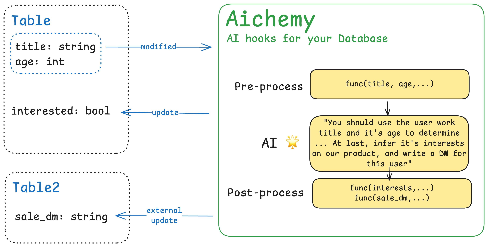

<div align="center">
  <picture>
      
    </picture>
  <h1>Aichemy</h1>
  <p><strong>🚧AI Hooks for your Database🚧</strong></p>
  <p>
    =3.9-blue">
    <a href="https://pypi.org/project/aichemy-py/">
      
    </a>
  </p>
</div>


***Aichemy is still in development and everything in this readme is a possible concept yet.***

Aichemy makes it easy to use AI in your database. Consider this as an observation layer that watch the changes in DB and act when possible. With powerful AI, many seemingly complex update logics can be implemented:

- When `age` is updated, combining with `title` to guess `interested`(bool, if user wants to buy our services).
- When `bio` is updated, combing with `name` to generate a personalized `sale_dm`(string, content of DM)
- ...

All you need to do is focusing on the business logic, and write the instructions clearly.

## Install

```
pip install aichemy-py SQLAlchemy
```

> aichemy only supports SQLAlchemy for now. 


## QuickStart

#### 1. Design your DB

```python
from sqlalchemy import create_engine, Column, Integer, String
from sqlalchemy.orm import declarative_base, sessionmaker


class User(Base):
    __tablename__ = "users"
    id = Column(Integer, primary_key=True)
    name = Column(String)
    title = Column(String)
    intro = Column(String)
    dm_message = Column(String, nullable=True)
    
    
engine = create_engine("sqlite:///test.db")
Base.metadata.create_all(engine)
Session = sessionmaker(bind=engine)
```


#### 2. Write `aichemy functions`

```python
import aichemy as ac

@ac.watch(User.intro).with(User.name, User.title).to(User.dm_message)
def write_dm(row: dict, results: dict):
  """Based on the user information, write a thank-you DM for our AI product."""  
  # 1. pre-process
  row[User.name] = row[User.name].capitalize()
	
  # 2. pass your descriptions
  yield {
    User.intro: "The self-introduction of the user",
    User.dm_message: "Write the dm_messages"
  }
  
  # 3. post-process
  results[User.dm_message] = results[User.dm_message][:200]
```

- `row` is a dict containing the values of (`User.intro`, `User.name`, `User.title`)
- You can use `docstring` of the function to write your instructions
- Before `yield`, you can modify the values inside `row` for pre-process. At this time, `results` is always empty and any changes to `results` is meaningless.
- You can yield the descriptions for both input and output, the descriptions will be used in the process of AI.
- After `yield`, you can modify the return values inside `results` before they're committed to Database


#### 3. Start watching

```python
write_dm.start()

with Session() as session:
    user = User(name="John", title="Software Engineer", intro="I love AI and basketball")
    session.add(user)
    session.commit()
    
with Session() as session:
    user = session.query(User).all()
    print([u.dm_message for u in user])
```

> By default, aichemy works in `sync` mode. That means the watched fields' writing will be blocked until the aichemy function finish. You can enable  `nowait` mode to stop aichemy block any of your DB operations.

```python
@ac.watch(User.intro).with(User.name, User.title).to(User.dm_message).nowait()
def write_dm(row: dict, results: dict):
  ...
```


#### 4. Debuging

Debug the prompt is easy in aichemy:

```python
write_dm.debug({
  User.name: "Gus",
  User.title: "Founder of Memobase",
  User.intro: "I'm a programmer",
})
```

